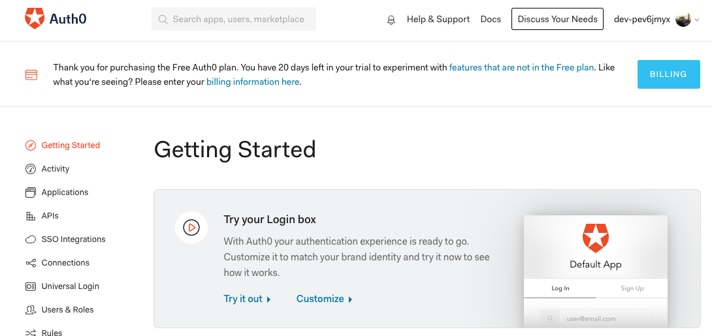

# Auth workshop

This workshop targets students of EPITA SIGL 2021.

You will integrate an SAAS IDP called [Auth0](https://auth0.com/) to Arlaide

## Step 1: Setup your account on Auth0

Go to https://auth0.com/auth/login and create an account with your github account.

Select the EU region to avoid to cross the world for a request and use a personnal account type.

Once your account created, you will have access to auth0 home page


To use Auth0 service in yours app, you need credentials. To get them, go to the Applications section in Auth0 dashboard.

A default Application is already available but we will create a new one called Arla:

- Click on Create Application button
- Name it `Arla` and select `Single Page Web Application`
- Click on Create

The dashboard propose you to see a Quick Start with the different technology. You can check it if you want. Some examples are available in Quick Start.

This TP is inspired from React Quick Start.

Now, we have credentials available in the settings tab of our application. For the first part, we only need of Domain and clientId.

Before starting to code, we need to configure the Callback URLs, Logout URLs, Allowed Web Origins.

You can put these 2 URLs (with comma sperator):

- http://localhost:3000
- https://goupe<Number>.arla-sigl.fr

The first will be use for local developpement and the second for our final app on yours server.

## Step 2: Integrate Auht0 login to your frontend

### Install the Auth0 React SDK

Auth0 provide an easy to use sdk for react.

First we need to install auth0 react sdk:

```
npm i -save @auth0/auth0-react
```

You can now import the sdk and start to configure the `Auth0Provider` component.

Under the hood, the Auth0 React SDK uses React Context to manage the authentication state of your users. One way to integrate Auth0 with your React app is to wrap your root component with an Auth0Provider that you can import from the SDK.

In your `app.tsx`, add:

- `import { Auth0Provider } from "@auth0/auth0-react";` with yours import
- `Auth0Provider` configuration

```typescript
...
import React from "react";
import ReactDOM from "react-dom";
import { Auth0Provider } from "@auth0/auth0-react";
...

ReactDOM.render(
    <Auth0Provider
    domain="YOUR_DOMAIN"
    clientId="YOUR_CLIENT_ID"
    redirectUri={window.location.origin}
    cacheLocation="localstorage"
    >
        <Authenticated>
            <TemplateMachineProvider>
            ...
            </TemplateMachineProvider>
        </Authenticated>
</Auth0Provider>
```

The Auth0Provider component takes the following props:

- `YOUR_DOMAIN` and `YOUR_CLIENT_ID`: The values of these properties correspond to the "Domain" and "Client ID" values present under the "Settings" of the single-page application that you registered with Auth0. (Be careful if you have a public repo to not pushed yours credentials)
- `redirectUri`: The URL to where you'd like to redirect your users after they authenticate with Auth0.

`Auth0Provider` stores the authentication state of your users and the state of the SDK — whether Auth0 is ready to use or not. It also exposes helper methods to log in and log out your users, which you can access using the useAuth0() hook.

### Add Login to Your Application

The Authenticated is here to automaticly redirecxt the user to Auth0 when it's not logged.
To do that:

- Create a file `Authenticated.tsx` in `components`
- Put the code below inside

```typescript
import React from "react";
import { useAuth0 } from "@auth0/auth0-react";

export const Authenticated: React.FC = ({ children }) => {
  const { loginWithRedirect, user, isLoading } = useAuth0();

  React.useEffect(() => {
    const redirect = async () => {
      if (!user && !isLoading) {
        await loginWithRedirect();
      }
    };
    redirect();
  }, [isLoading]);
  return isLoading ? <span>Loading ...</span> : <>{children}</>;
};
```

We used a React useEffect to automaticly redirect the user.

### Add Logout to your Application

`useAuth0` hook is providing a `logout` method enabling the user to kill his active auth session.

Create a new `src/components/Logout.tsx` component with:

```tsx
import { useAuth0 } from "@auth0/auth0-react";
import { Button } from "@material-ui/core";
import React from "react";

export const Logout: React.FC = () => {
  const { logout } = useAuth0();
  return (
    <Button
      variant="outlined"
      color="primary"
      onClick={() => {
        logout({ returnTo: document.location.origin });
      }}
    >
      Logout
    </Button>
  );
};
```

And add the following changes to your main `TemplateLayout.tsx` component:

```tsx
import React from "react";
import { makeStyles, createStyles, Theme } from "@material-ui/core/styles";
import Grid from "@material-ui/core/Grid";
import { Typography } from "@material-ui/core";
import { TemplateMachineContext } from "../state/provider";
import { Logout } from "./Logout";
import { useAuth0 } from "@auth0/auth0-react";

// ...

export const TemplateLayout: React.FC = ({ children }) => {
  // ...
  const { user } = useAuth0();

  return (
    <Grid
      className={classes.root}
      container
      direction="row"
      justify="center"
      alignItems="center"
      spacing={3}
    >
      <Grid item xs={12}>
        <Typography variant="h1" align="center" gutterBottom>
          Frontend Workshop
        </Typography>
        <Typography variant="subtitle1" align="center">
          {user?.email || "EPITA SIGL 2021"}
        </Typography>
        <Typography variant="subtitle2" align="center" color="primary">
          <Logout />
        </Typography>
      </Grid>
      <Grid item xs={12}>
        {children}
      </Grid>
    </Grid>
  );
};
```

Important lines are:

```tsx
    const { user } = useAuth0();
    //...
   <Typography variant="subtitle1" align="center">
          {user?.email || "EPITA SIGL 2021"}
    </Typography>
    <Typography variant="subtitle2" align="center" color="primary">
        <Logout />
    </Typography>
    //...
```

This will display the user email you've logged in with and display a `Logout` button that should redirect you to the main page.

## Step 3: Secure your API

In the previous workshop, you've created a web API exposing help requests.

Now it is time to secure it.

It means a user needs to get authenticated to call your web API.

### Create your API in Auth0

Create a new API in Auth0:

- go to your Dashboard > API > Create new API
- Set the following fields (adapt for your group name):
  - Name: arla-group-XX-api
  - Identifier: https://api.groupeXX.arla-sigl.fr
  - Leave default signing algorithm: RS256

From your `api/` code, adapt with the code Auth0 provides in its QuickStart > NodeJS section:

- install dependencies
```sh
# from api/
nvm use
npm i --save express-jwt jwks-rsa
npm i --save-dev @types/express-jwt @types/jwks-rsa
```

```ts
// src/server.ts
//...
import jwt from "express-jwt";
import jwks from "jwks-rsa";
//...

const jwtCheck: express.RequestHandler = jwt({
  secret: jwks.expressJwtSecret({
    cache: true,
    rateLimit: true,
    jwksRequestsPerMinute: 5,
    jwksUri: // CHECK QUICKSTART FOR VALUES
  }),
  audience: /* CHECK QUICKSTART FOR VALUES */,
  issuer: /* CHECK QUICKSTART FOR VALUES */,
  algorithms: ["RS256"],
});

// ...

app.get(
  "/v1/help-request",
  jwtCheck,
  (request: express.Request, response: express.Response): void => {
    // ...
  }
);
```

That's it! You've secured your API. `jwtCheck` is a middleware that will check if the `Bearer` token is valid.


### Adapt your frontend component in the frontend

Set the `audience` property of your `<Auth0Provider />` to your `API Identifier` from your newly created API in Auth0:

```tsx
// inside src/app.tsx
// ...
<Auth0Provider
    // ...
    audience={/* Your API Identifier */}
    cacheLocation="localstorage"
  >
```
This will make sure the token you get after authentication has rights to access your API.


### Call you secured API from your frontend

This flow will be demonstrate in class.

## Step 5: Adapt your build for production

You are currently using `http://localhost:3000` for your `API_ENDPOINT`.
It is correct for when you're developping, but on production, you need to use `https://api.groupeXX.arla-sigl.fr` for your `API_ENDPOINT`.

How to adapt your build to have the correct endpoint depending on which environment you're on?

You need to use environment variable.

Your frontend code is built on:

- your local machine when developping
- on github action when deploying

to have the correct `API_ENDPOINT`, adapt your webpack config like here: https://github.com/ffauchille/arla-group-11/blob/master/frontend/webpack.config.js

## Step 6: Use permissions to have 2 different profiles of users

This will be shown in class.
